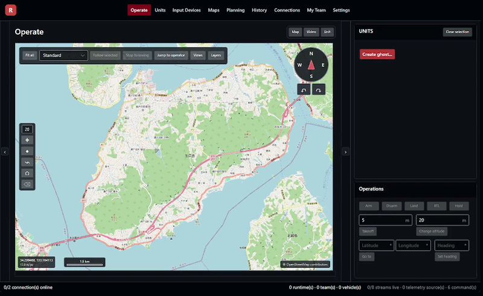
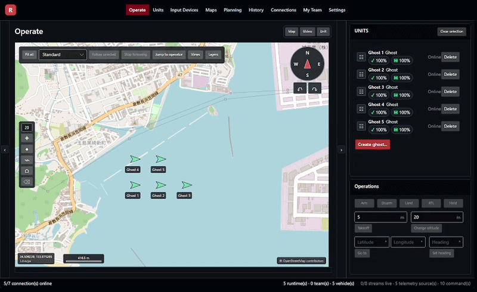
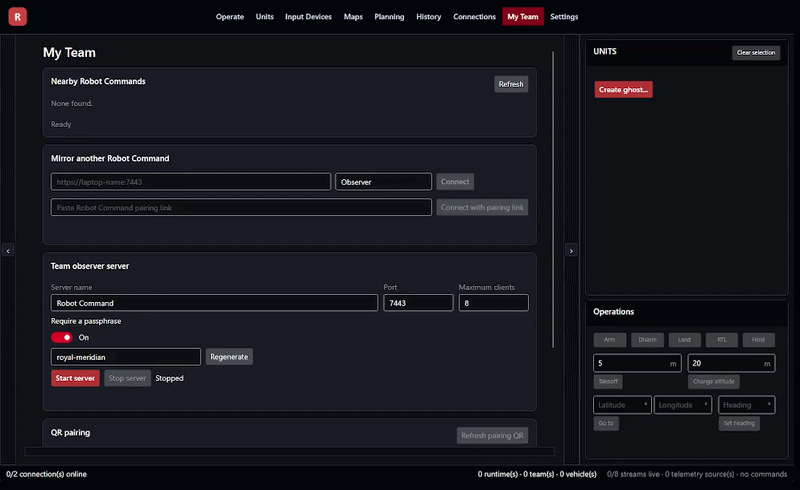
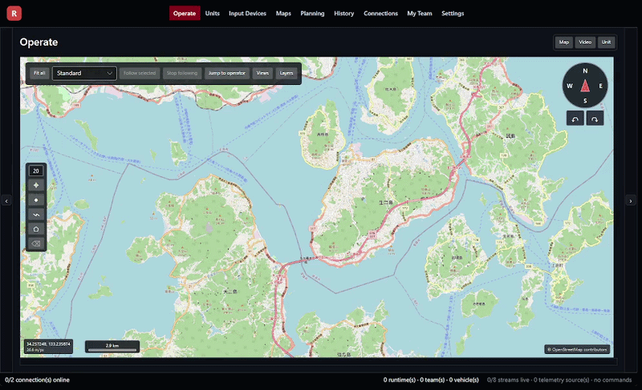

# Robot Command

Robot Command is a desktop ground-control application for operating field robots, with an initial focus on drones. Robot Command is built with a many-vehicle, many-operator philosophy to serve as a planning and operations application. Currently supports simulated Ghost, PX4, ArduPilot, and Logos drones. Robot Command is intentionally not a setup, configuration, or analysis program. Robot Command is open source under the Apache 2.0 licence. Community contributions are welcome, encouraged, and will be fully credited.

## Download

[Download Robot Command for Windows](https://github.com/Psycraft-Corporation/Robot-Command/releases/latest)

Windows only for now. macOS and Linux support will follow.

## Ghosts

Ghosts are local simulated vehicles for learning the interface, trying workflows, and building repeatable tests without connecting to aircraft.

## Teams and formations

Teams group vehicles for coordinated operations. Formations define shared positions and let a Team move, rotate, resize, change altitude, or hold as one operation.

## My Team

My Team provides a session-only, read-only view for approved observers. Start the local server, share the endpoint and passphrase, and review the connected presentation from another Robot Command instance.

## CLI

The CLI exposes the same operational workflows for scripts, diagnostics, and repeatable field procedures. It supports human-readable, JSON, and event-stream output.

## Learn more

- [Operations and safety](docs/operations-and-safety.md)
- [Mission authoring](docs/mission-authoring.md)
- [MAVLink camera and gimbal controls](docs/mavlink-camera-controls.md)
- [Architecture](docs/architecture.md)
- [Development](docs/development.md)
- [Support](docs/support.md)
- [SDK and packages](docs/sdk-and-packages.md)
- [Contributing](CONTRIBUTING.md)
- [Security](SECURITY.md)

Robot Command is licenced under Apache-2.0. See [LICENCE](LICENCE) and [NOTICE](NOTICE).
